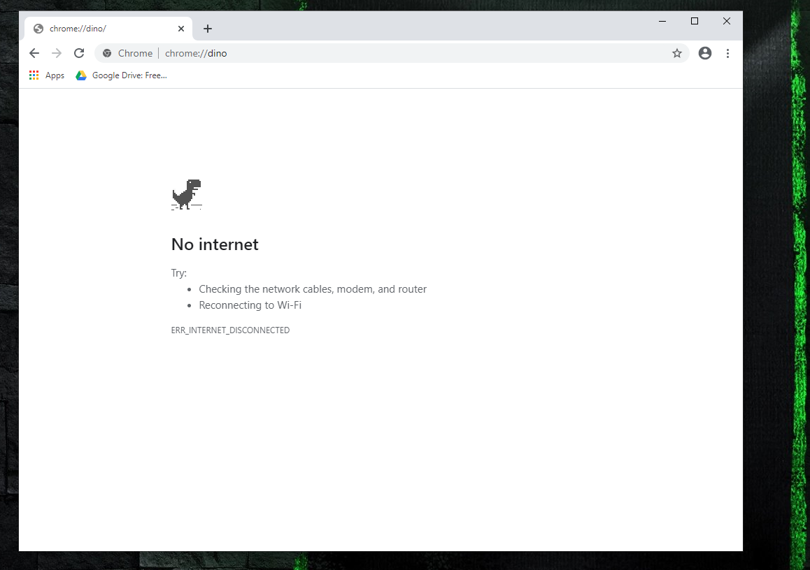
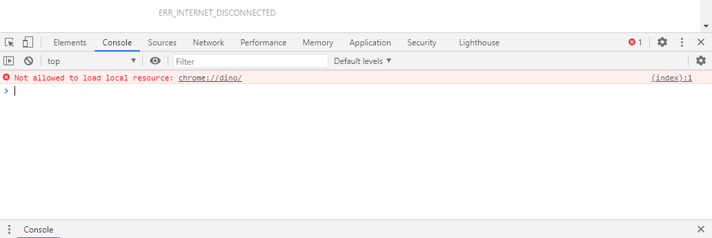
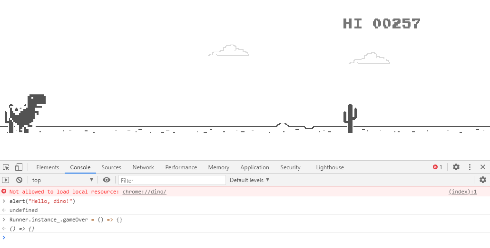

#### What is the running dinosaur game, and how does it work?
If you use Google Chrome for your web browsing needs, you've likely encountered the running dinosaur before, an Easter egg built into 
the browser to make those excruciating moments (or hours, or days if you're extraordinarily unlucky) without Internet a little less unbearable. When 
Google Chrome detects that your computer's Internet connection has been disrupted, you'll see the below page, at which you can press the 
spacebar to kick off a lightweight and admittedly addicting game. Alternatively, you can just type chrome://dino into the address bar of 
Google Chrome if you want to get there _without_ shutting down your Internet connection.

Before digging into the fun bits of this post, let's talk about what's happening here. This game is running without an Internet connection, 
and inside of a web browsing program. Without an Internet connection, it's not talking to a remote web server in order to operate, making it 
*client-side*. And since it is running commands and executing logic inside of a web browsing program, we can (pretty safely) assume that it's 
using *JavaScript*. So as a brief lesson about a couple of web development buzzwords: doing stuff without talking to a remote server = 
client-side code; executing and running sophisticated logic within a web browser based on a set of commands: probably JavaScript.

#### Client-side developer tools
Some of the greatest tools in the arsenal of web developers lie within the Developer Console that comes packaged in with all popular web 
browsers. Google Chrome, Mozilla Firefox, Microsoft Edge, and Safari all have their own versions of the Developer Console. It allows 
developers to see various bits of important information, and even manipulate what's happening for the sake of troubleshooting and observing 
behavior of webpages and webapps. In fact, the savvy developer can even manipulate the JavaScript code running on a web page in real-time to see 
how it would behave differently under different circumstances.

To access the Developer Console in Google Chrome, since that is the subject of my post today, you click on the three vertical dot settings menu, 
then go to _More Tools > Developer tools_. Alternatively, you can hit ``F12`` or ``CTRL+SHIFT+I``.

_Google Chrome Developer Console_

Once you've got the Developer Console open, let's take it for a test drive. As said above, we should now be able to execute arbitrary JavaScript 
commands inside of this console to manipulate the page. So in the _Console_ tab (as shown in the screenshot above), type in 

``alert("Hello, dino!")``

The ``alert`` function in JavaScript tell the browser to throw up a pop-up box to _alert_ the user of the information passed in to the function. So 
we ought to see a standard Chrome-looking pop-up box with a greeting for our little dino friend. 

So you might be wondering: if the running dinosaur game is running within the web browser, client-side, with JavaScript, on the current page... And I am 
given control through the Developer Console to manipulate the JavaScript code on a page... doesn't that mean I can do wacky things with the Running 
Dinosaur Game? Well, yes! That's why we're here.

#### Unstoppable Dino
Go big, or go home. Right? Let's jump in and do the most ambitious modification to the game environment first: make our dinosaur **unstoppable**. If you've 
ever played through the running dino game, you'll know that it's Game Over when you fail to jump at the correct time and our little running friend meets a 
cactus plant face first. Well what if we wanted to bypass that? What if we wanted to laugh in the face of Game Over?

With our running dinosaur game open at ``chrome://dino`` in your address bar, and the Developer Console open with ``F12`` or ``CTRL+SHIFT+I``, let's 
get to work. Enter into the Console tab:

``Runner.instance_.gameOver = () => {}``

Once that's in, go ahead and start the game by pressing the spacebar key, and watch as your dinosaur gleefully runs through all of the cactuses without 
so much as a scratch. 

##### Breakdown of what we did
So what did our little line of code actually do to the dino game to make our protagonist plow through those dastardly cacti? In short, we basically deleted 
the "Game Over" function. As it is originally intended, whenever the dino runs into a cactus, the ``Runner.instance_.gameOver()`` function is called. All of the 
commands that are inside of that function are executed. Some things that would likely happen in that function are:
* Stop the dino from moving
* Show the "Game Over" message to the user
* Stop the time and score counters

These are exactly the things that we **don't** want to happen, so we clobber it and replace it with an empty function instead. JavaScript's language syntax has 
a lot of shorthand notations to make code prettier and easier to read. One of those shorthand offerings is something called <a href="https://developer.mozilla.org/en-US/docs/Web/JavaScript/Reference/Functions/Arrow_functions" target="_blank">arrow functions.</a> So ``() => {}`` translates to "a function that does nothing." 
So, the line that we entered above to give our dino immortality without arrow functions would look like this:

``Runner.instance_.gameOver = function() {}``

#### Other dino things to hack
So using the same principal as above, here are a few more things to experiment with on your own:
* ``Runner.instance_.setSpeed(number)`` - Replace _number_ with any positive number and see what happens
* ``Runner.instance_.isDarkMode = true`` - Enter this with _true_ or _false_ to see what difference it makes
* ``Runnter.instance_.restart()`` - Bet you can guess what this might do

#### Conclusion
As awesome as having this kind of control over your web browser is, it's important to remember that these modifications and experiments live only on the 
_client-side_ in your current browser tab, and do *not* persist. To see what I mean, reload your browser page by clicking the refresh button in Chrome or 
hitting ``F5`` on your keyboard. Once the dino game reloads, you'll notice any modifications you've made are gone. An important reminder that the Developer 
Tools are for debugging to give web developers an idea of what certain things might do to change an environment, they are not for making persistent and 
lasting changes. Have fun. Go forth, dino, and conquer the cactus-infested landscape of no-Internet land!