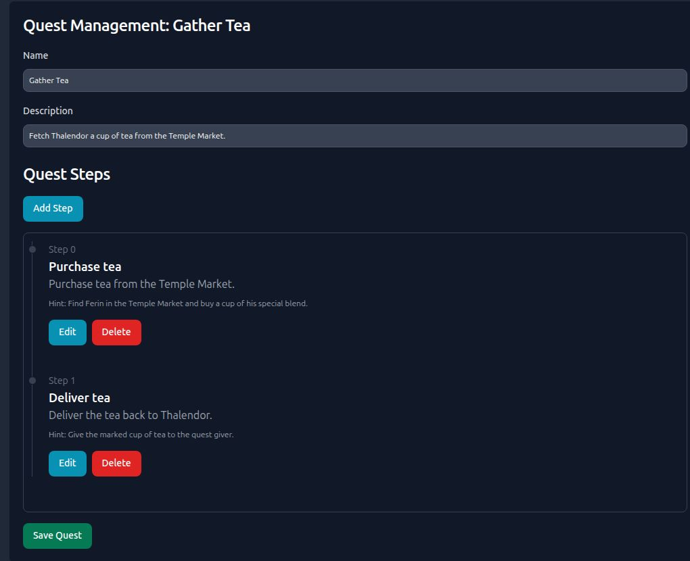
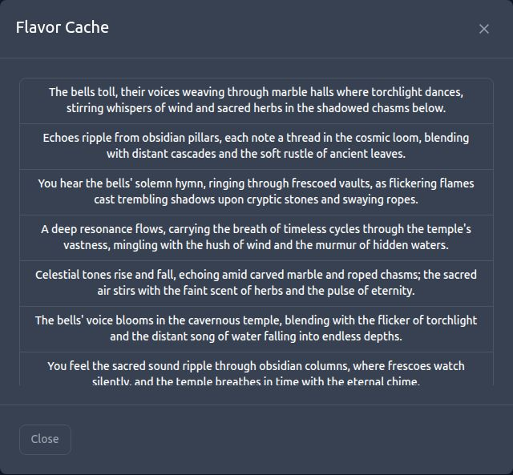
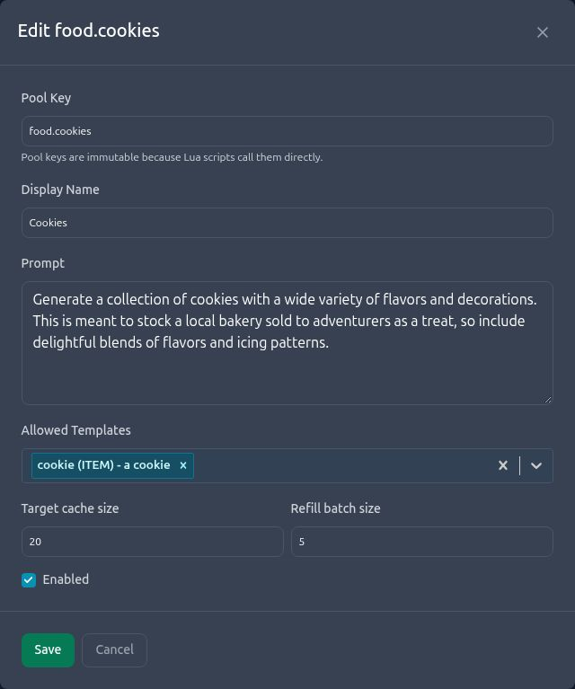
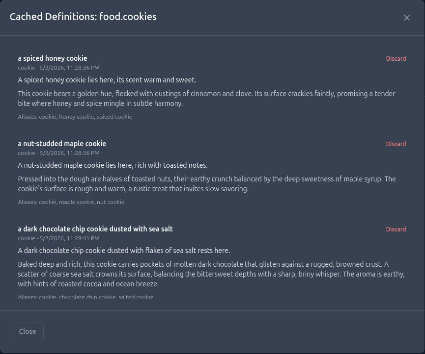

I’ve been playing MUDs for a long time. If you haven’t played one, a MUD is basically a multiplayer world you explore through text. Rooms, characters, items, encounters—all of that comes through descriptions and the commands you type. I played them for years, and I’ve always had a passion for programming, so eventually those two things came together: hey, I could become a better programmer by building my own MUD engine.

## My version of Hello World

That became my thing. Every time I learned a new programming language, I wanted to understand it by writing a MUD engine in it. That was basically my Hello World. I think the first one was Java. There was Python, there was Rust, and over time there have been a lot of iterations.

The most mature version is Revelation, which is built in TypeScript and extended with Lua. It’s probably the most significant personal project I’ve built, and it’s been a hell of a time getting here.

## A world to build with friends

At some point, one of those iterations crossed a threshold where I thought, man, this actually feels like a living environment. I mentioned it to a couple of friends who weren’t happy with the games they were playing at the time. They thought it would be fun to log into a completely fresh world and just start building around themselves.

That turned into about half a dozen of us building a game called Triloka Eternal with the Revelation engine. It’s a slow passion project. Nobody’s working on it full-time. We circle back when we can, and it’s become something that’s really near and dear to us.

What’s cool about Revelation is that it’s grown into a suite of tools. The Lua layer lets volunteer scripters build content and dynamic things in the game without needing to work on the TypeScript engine itself. There’s also a web application with a visual editor, so people can build rooms, quests, denizens, and encounters.

## Enter the Dungeon Master

And then there’s the AI layer, which I call the Dungeon Master.

It can see who’s online and what’s happening in the world, and use that information to create experiences. Maybe there’s a player wandering around an area, and it decides to spawn an encounter there to give them something to engage with.

The first time that really clicked for me, I was walking around building and testing things. A denizen—a character in the game—that I’d never met before walked up, greeted me, and had a quest for me. The AI had noticed me in the area and created that encounter.

That was a pretty cool moment. I was experiencing something in my own game that I hadn’t personally put there. It felt like a very 2026 spin on something I’d loved for years.

## The spoon of everlasting power

But the hardest part was figuring out how to let the AI operate in the world predictably. It’s easy to get excited and give it the ability to change whatever it wants. That can be fun to demonstrate. When you’re trying to build an engine that people can actually use, though, you have to think a lot harder about what you’re allowing it to do.

We learned that with item creation.

The way items work in Revelation, there’s a catalog of master templates. Those are general things like forks, spoons, and swords. When you spawn one in the game, you create what we call a replica. That particular replica can have its own description, its own flair, and things that happen when you activate it.

Early on, we weren’t strict enough with the APIs. We’d ask the AI to create something like the spoon of everlasting power, and it would start improvising. It would create new master templates, duplicate existing ones, and generally make a mess of our data structures.

What we actually wanted was for it to take a spoon from the existing catalog and make that particular spoon interesting. We had a collection of base items and a certain feel we wanted for the world. We didn’t want it expanding that catalog every time it had an idea.

That took work. We had to get much more deliberate about the APIs we exposed and the constraints around them. Creating items, spawning denizens, making quests, granting gold or experience—you need to spell out what the AI can actually do in your world.

For me, that was a big lesson in slowing down. I had to stop chasing whatever was shiniest for a minute and make responsible choices about how the system should work. Getting an impressive result once is exciting. Making the behavior predictable takes a different kind of effort.

## Why I keep coming back

Even with all that, I can really only go a couple of months before I get the itch to get back into it. It just brings me a lot of joy.

There’s something special about being logged into a game with your friends while you’re all building that same world. You create a room, and suddenly it’s there. You can walk into it. You can look around and read this awesome description somebody wrote, and you’re experiencing the thing as you’re making it.

That’s a hard feeling to replicate. It’s an immersive building experience, and every couple of months I get that hankering to dive back in.

## A peek at the tools behind it

I mentioned the web editor earlier, but I want to actually show some of it, because I think this part is freaking cool. Revelation has grown into something people can sit down with and use to build a world together. Triloka Eternal is the world we’re building with it.

### Building somewhere you can walk into

Here’s what editing a room looks like. You write the descriptions, choose its environment, and decide what someone can interact with. A mirror they can look into, a tree they can touch—those little things give a place some life. The editor has room for those interactions without making someone write a script for every detail.

*The room editor brings the writing and the things a player can do into the same place.*

Quests have their own editor too. This one is a simple tea delivery: get the tea, then bring it back. You can see the steps and work on them individually. There’s something satisfying about seeing a little errand laid out like this and knowing someone will eventually be walking around doing it.

*A small quest, broken into the steps a player will follow.*

### Giving the world a little more life

The AI Content tools are where this gets really interesting to me.

One part handles what we call flavors: bits of atmospheric text that can make the world feel like something is happening around you. In this example, it’s temple bells. We can give the generator a direction, set limits on the length, and keep a collection of messages ready for the game to use. There’s also a shared style guide so those different bits of content have some consistency with the world we’re making.

*Atmospheric text is generated ahead of time and can be inspected in the admin interface.*

I like being able to actually look through the results. You can see what’s there, rather than having to wander around hoping the right bit of text happens to appear while you’re testing.

### Yes, even the cookies have a system

Then there are dynamic replica pools. This is a pretty direct result of the lesson with the spoon.

Take a cookie. We already have a cookie template. What we want is variety: a spiced honey cookie, a maple cookie with nuts, a chocolate chip cookie with sea salt. They can have their own descriptions and details while still coming from the base item we chose.

*The pool defines both the creative direction and the templates it’s allowed to use.*

That screen lets us choose the allowed templates and how many variations to keep ready. Then we can open the cache and see the individual results, including which template each one came from. If something doesn’t fit, there’s a way to discard it.

*Different cookies, all built from the approved cookie template.*

The part I care about underneath all this is that generating a definition doesn’t put an item into the world. Our Lua scripts decide when to spawn one. They take a ready-made definition from the pool, and the engine queues a refill in the background. An empty pool can return immediately instead of making the game wait for an AI response.

The engine also limits which properties those generated definitions can change. The AI doesn’t get to slip in a new script, set a price, or invent combat behavior through a cookie description.

That’s the sort of thing I’ve spent a lot of time on with Revelation. I want room for surprising, interesting results, and I want the people building the game to have useful controls over them. And apparently, sometimes working on that means spending an evening thinking very seriously about cookies.

If that sounds like something you’d enjoy, take a look at [Triloka Eternal](https://trilokaeternal.com/). The game isn’t live yet, but you can create an account and join the mailing list for updates and access announcements. We’re taking our time with it, but I’d love for people to follow along.
